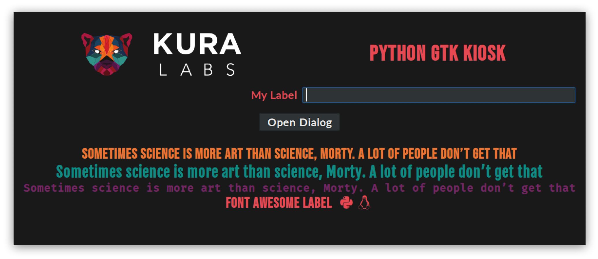

================
Python GTK Kiosk
================

Example of Python kiosk application using GTK. This application was coded using
Gtk (pygobject dynamic bindings), designed in Glade.

This is particularly suited to be used in a Raspberry Pi.

**Note:** Documentation assumes Raspbian Buster Lite.

Kiosk Mode Setup
----------------

#. Install dependencies:

   ::

       sudo apt install build-essential python3-dev python3-gi

#. Enable autologin to CLI:

   ::

       sudo systemctl set-default multi-user.target
       sudo ln -fs /etc/systemd/system/autologin@.service /etc/systemd/system/getty.target.wants/getty@tty1.service

#. Install X Window Server:

   ::

       sudo apt update
       sudo apt install xserver-xorg xinit x11-xserver-utils xdotool xterm

   - ``x11-xserver-utils``: to change cursor with ``xsetroot``
   - ``xdotool``: to move mouse with a command
   - ``xterm``: to test before adding the ``.xinitrc``

#. Start X Window Server on autologin:

   ::

       nano ~/.bash_profile

   And add:

   ::

       # Start window manager on first login shell
       if [[ ! $DISPLAY && $XDG_VTNR -eq 1 ]]; then
           exec startx

       # Load .bashrc when using SSH
       elif [ -f ~/.bashrc ]; then
           source ~/.bashrc
       fi

   .. note::

      ``.bash_profile`` is executed for login shells, while ``.bashrc`` is
      executed for interactive non-login shells.

#. Start your application when X Window Server starts:

   ::

       nano ~/.xinitrc

   And add:

   ::

       # Change default X cursor to left arrow
       xsetroot -cursor_name left_ptr

       # Move cursor out of the way
       xdotool mousemove 2000 2000

       # Start application
       if hash python-gtk-kiosk 2>/dev/null; then
           mkdir -p ~/.config/python-gtk-kiosk/
           exec python-gtk-kiosk --kiosk -vvv 2>>~/.config/python-gtk-kiosk/logs.log
       else
           exec xterm
       fi

Development
-----------------------

This application was coded using Python 3.5 on Ubuntu 18.04. Other OS versions may
work but are untested.

::

    sudo apt install python3-pip python3-gi glade
    sudo pip3 install tox

Running App
===========

::

    tox -e run

Build package
=============

This will build the package. Both wheel and source distribution will be
available under ``dist`` directory.

::

    tox -e build

License
=======

::

   Copyright (C) 2019 KuraLabs S.R.L

   Licensed under the Apache License, Version 2.0 (the "License");
   you may not use this file except in compliance with the License.
   You may obtain a copy of the License at

       http://www.apache.org/licenses/LICENSE-2.0

   Unless required by applicable law or agreed to in writing,
   software distributed under the License is distributed on an
   "AS IS" BASIS, WITHOUT WARRANTIES OR CONDITIONS OF ANY
   KIND, either express or implied.  See the License for the
   specific language governing permissions and limitations
   under the License.